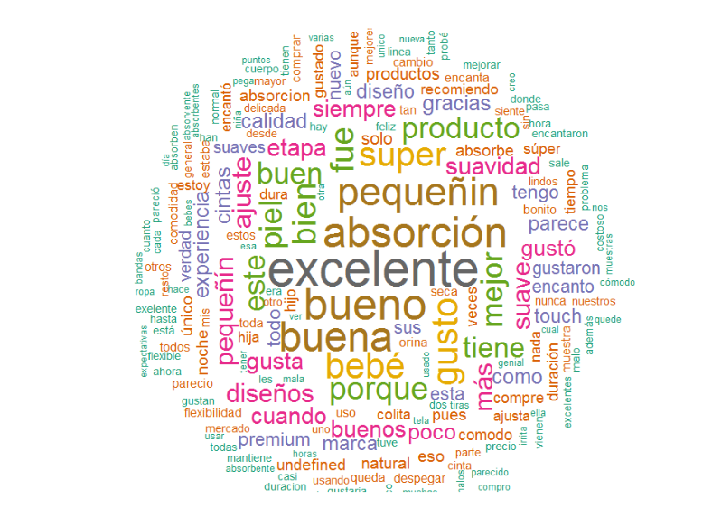
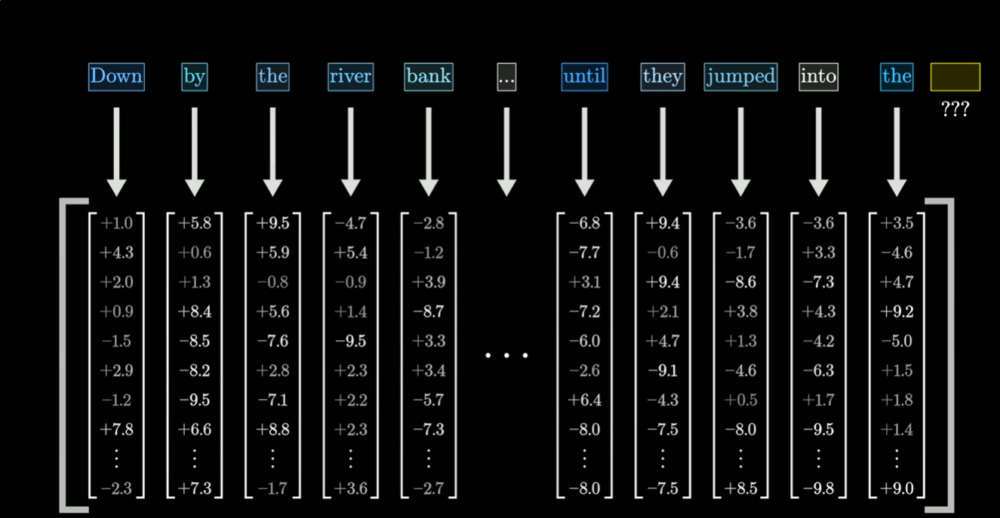
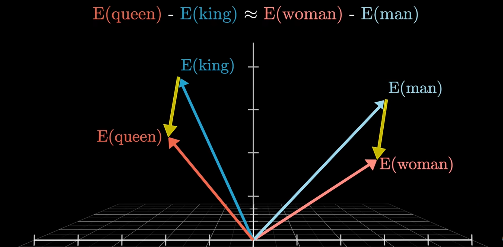
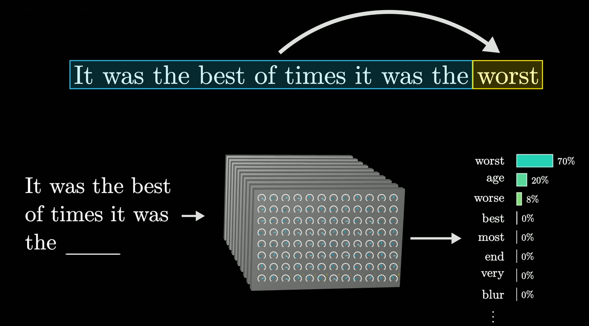
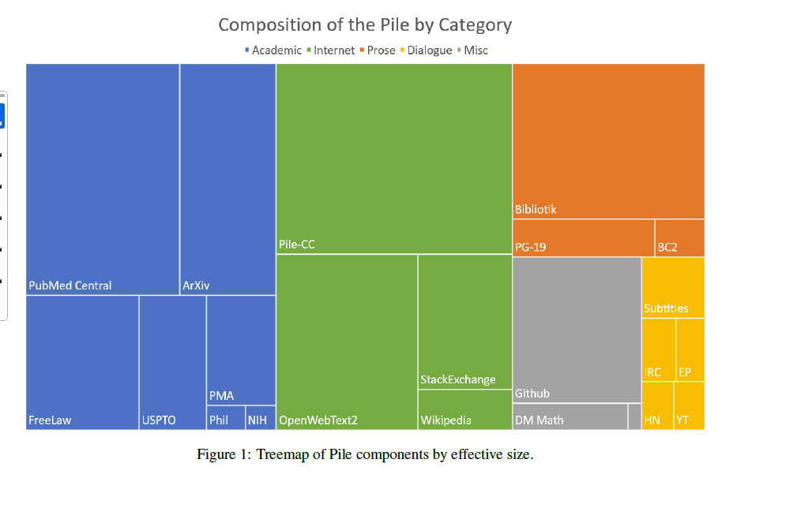
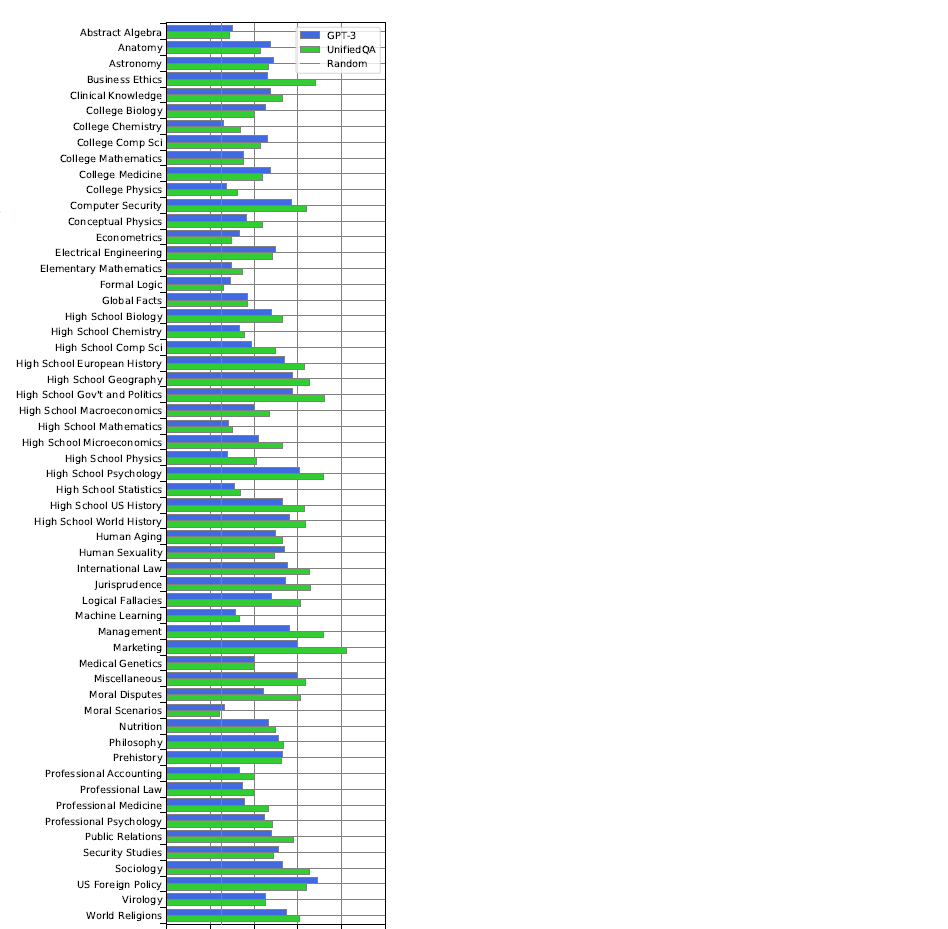
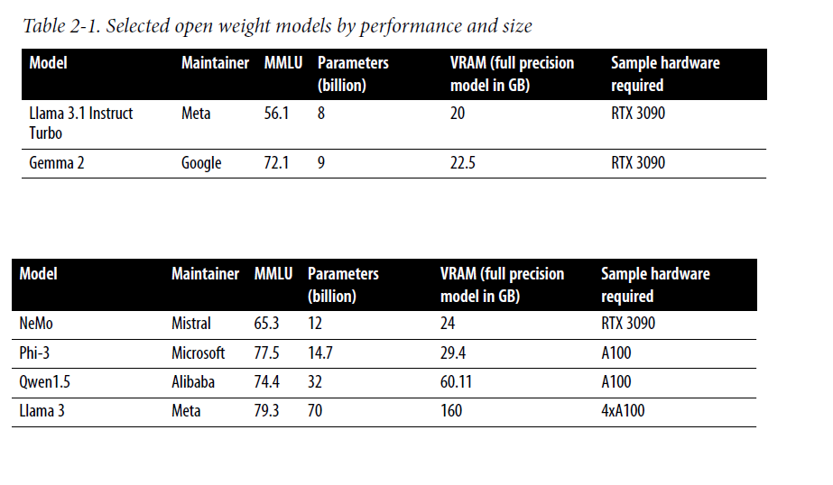
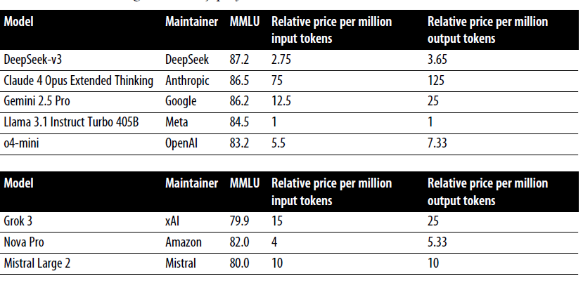

# Objetivo

- Nivelar conceptos
 
- Opciones para el área

# Nivelar

- ¿Estamos hablando de lo mismo?
- ¿De qué hablamos cuando hablamos de IA generativa?
  - ChatGPT / Claude
  - Prompts
  - DALL-E
  
# Texto y Lenguaje natural

- Aplicamos modelos estadísticos para entender patrones en texto.

# Breve historia de los modelos de texto

- Nube de palabras

# 2023: Chat GPT

- Salto cuántico en 2023.

# Embeddings

# Embeddings (2)

# Next token prediction

# Redes neuronales 

# Grandes volumenes de texto 

# Salto cuántico en la performance

# Conceptos importantes

- Modelo, Parámetros
- Tokens
- Entrenamiento
- Inferencia

# Conceptos importantes (2)

- Ventana de contexto
- Prompt engineering
- RAG
- multimodalidad

# Riesgos
  - Halucinaciones
  - Falta de reproducibilidad
  - Privacidad
  

# Panorama de modelos

- Frontier, foundation, open source

# Tabla

# Tabla (2)

# Panorama de productos

- Chatbots (ChatGPT, Gemini)
- Notebook LM
- Deep research
- Boti
- Modelos de negocio (por tráfico, por persona).

# Casos de utm_source

# Agentes

- Claude Code
- Deep research
- Copilot

# Referencias

- https://www.microsoft.com/en/customers/story/21596-government-of-the-city-of-buenos-aires-azure-open-ai-service?utm_source=chatgpt.com